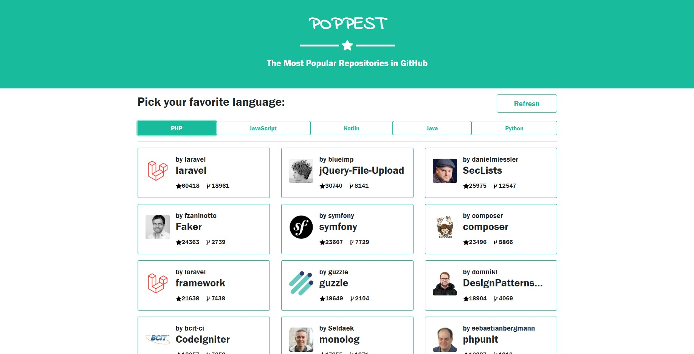

<h1 align="center">
  :star: Poppest - The Most Popular Repositories in GitHub
</h1>

- **Project developed by:** [Julio L. Muller](https://github.com/juliolmuller)
- **Released on:** Jun 16, 2019
- **Updated on:** Sep 1, 2020
- **Latest version:** 1.3.0
- **License:** MIT



This application was proposed by [Ateliware](https://ateliware.com.br/), as part of their recruitment process. The challenge was to consume GitHub API, searching for the 30 most popular repositories for 5 programing languages of my choice, store the data in a database and make this info available through a front-end interface. The use of a backend framework was mandatory.

[Check out the application running!](https://poppest.herokuapp.com/)

## :trophy: Lessons Learned

- Communicate to [GitHub API v3](https://docs.github.com/v3/);
- Use an HTTP client package for PHP;
- Build a React app within Laravel environment;
- Use SASS to overwrite Bootstrap standard variables;

## :hammer: Technologies & Resources

**Frontend:**
- [React 16](https://reactjs.org) (with Hooks & TypeScript)
- [jQuery 3](https://jquery.com/)
- [Bootstrap 4](https://getbootstrap.com/)
- [Axios](https://github.com/axios/axios) (HTTP client)

**Backend:**
- [PHP 7.2](https://php.net/)
- [Composer](https://getcomposer.org/) (PHP package manager)
- [Laravel 5.8](https://laravel.com/)
- [MySQL](https://www.mysql.com/)
- [Ixudra PHP cURL](https://github.com/ixudra/curl)

**Testing:**
- [PHPUnit](https://phpunit.de/) (embedded into Laravel)

**Deploy:**
- [Heroku](https://www.heroku.com/) (cloud platform)

**Development:**
- [Visual Studio Code](https://code.visualstudio.com/)
- [Cmder](https://cmder.net/) (terminal emulator)
- [Node.js](https://nodejs.org/en/) scripts (with Laravel Mix)
- [Postman](https://www.getpostman.com/) (platform for API development)

## :bell: Setting up the Environment

To allow Laravel to use you local configurations like database setup and credentials you will need to rename the file **.env.example** to **.env** and update the values for the `DB_*` variables accordingly. Besides, make sure you have a database created to migrate the schemas and data.

You will also need **Composer** and **Node.js** installed in your machine and their `composer` and `npm` shortcuts available via command line.

To set up your server-side environment, use the following commands:

```bash
$ composer install           # To download PHP dependencies
$ php artisan migrate --seed # To run migrations and seeding
$ php artisan serve          # To start the server
$ "./vendor/bin/phpunit"     # To run automated tests
```

When dealing with the front-end, you must use `yarn` to run the scripts:

```bash
$ yarn install    # To download JavaScript dependencies
$ yarn watch      # To keep compiling to 'public/' while developing
$ yarn production # For minified bundle for production
```
