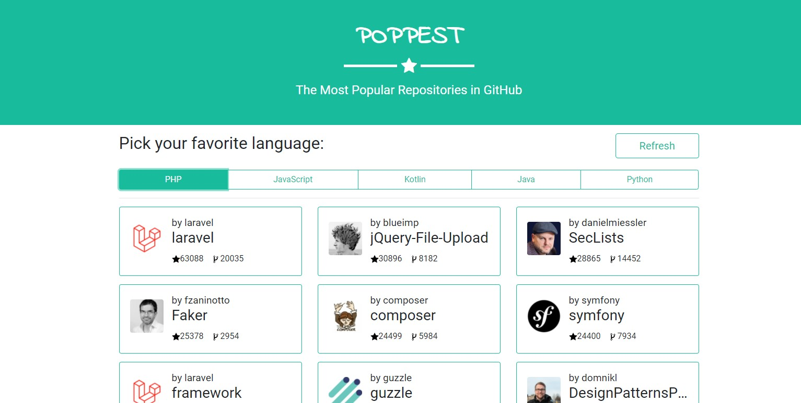

<h1 align="center">
  :star: Poppest - The Most Popular Repositories in GitHub
</h1>

<p align="center">
  <a href="#trophy-lessons-learned">Lessons Learned</a>&nbsp;&nbsp;&nbsp;|&nbsp;&nbsp;&nbsp;
  <a href="#rocket-technologies--resources">Technologies</a>&nbsp;&nbsp;&nbsp;|&nbsp;&nbsp;&nbsp;
  <a href="#hammer-setting-up-the-environment">Environment Setup</a>
</p>

<p align="center">
  

  

  

  

  
</p>



This application was proposed by [Ateliware](https://ateliware.com.br/), as part of their recruitment process for full-stack developer. The challenge was to consume [GitHub API](https://docs.github.com/v3/), searching for the 30 most popular repositories for 5 programing languages of my choice, store the results in a database and make this info available through a front-end interface. The use of a backend framework was mandatory. The final app should also be deployed to a public server, like Azure, AWS or Heroku.

[Check out the application running!](https://poppest.herokuapp.com/)

## :trophy: Lessons Learned

- Communicate to [GitHub API v3](https://docs.github.com/v3/);
- Use an HTTP client package for PHP;
- Build a React app within Laravel environment;
- Use SASS to overwrite Bootstrap standard variables;

## :rocket: Technologies & Resources

**Frontend:**
- [React ~~16~~ 17](https://reactjs.org) (with Hooks & TypeScript)
- [jQuery 3](https://jquery.com/)
- [Bootstrap 4](https://getbootstrap.com/)
- [Axios](https://github.com/axios/axios) (HTTP client)

**Backend:**
- [PHP ~~7.2~~ 7.4](https://php.net/)
- [Composer](https://getcomposer.org/) (PHP package manager)
- [Laravel ~~5.7~~ 8](https://laravel.com/)
- [~~MySQL 8~~](https://www.mysql.com/) [PostgreSQL 13](https://www.postgresql.org/)
- [~~Ixudra PHP cURL~~](https://github.com/ixudra/curl) (updated to use Laravel's default  HTTP client façade)

**Testing:**
- [PHPUnit](https://phpunit.de/) (embedded into Laravel)

**Deploy:**
- [Heroku](https://www.heroku.com/) (cloud platform)

**Development:**
- [PhpStorm](https://www.jetbrains.com/phpstorm/) and [Visual Studio Code](https://code.visualstudio.com/)
- [Cmder](https://cmder.net/) (terminal emulator)
- [Node.js](https://nodejs.org/en/) scripts (with Laravel Mix)
- [Postman](https://www.getpostman.com/) and [Insomnia](https://insomnia.rest/) (platform for API development)

## :hammer: Setting up the Environment

To allow Laravel to use you local configurations like database setup and credentials you will need to rename the file **.env.example** to **.env** and update the values for the `DB_*` variables accordingly. Besides, make sure you have a database created to migrate the schemas and data.

You will also need **Composer** and **Node.js** installed in your machine and their `composer` and `npm` shortcuts available via command line.

To set up your server-side environment, use the following commands:

```bash
$ composer update            # To download PHP dependencies
$ php artisan migrate --seed # To run migrations and seeding
$ php artisan serve          # To start the server
$ composer run test          # To run automated tests
```

When dealing with the front-end, you must use `yarn` to run the scripts:

```bash
$ npm install      # To download JavaScript dependencies
$ npm watch        # To keep compiling to 'public/' while developing
$ npm production   # For minified bundle for production
```
